<!-- Little Tikes Story Dream Machine LTSDM custom cartridge SPI flash P25D80SH reverse engineering hex hexadecimal file format PCM audio extraction embedded Arduino a1800 codec general plus collection imhex hack .a18 .wav 16khz 16-bit signed mono -->
<h1 align="center">:construction:Under Construction:construction:</h1>

<h1 align="center">
  Custom Stories for the
   
  Little Tikes Story Dream Machine (LTSDM)
</h1>

🔜 
  
<h1 align="center">What Is This?</h1>
 <i>not my image</i>   

<body>
  The <a href="https://www.littletikes.com/collections/story-dream-machine?srsltid=AU7gw4WqiQ8R5CqPzf9FcHDLHLqfhu1rZ22Jz5EO_xHfze3l0G6kVn3B">Little Tikes Story Dream Machine (LTSDM)</a> is a toy projector geared towards young children. Each story is kept in a cartridge, or "book," that is physically inserted into the projector. Inside, the cartridge holds the following:
  
  1) audio data to be played on the projector's speakers
  2) digital instructions for the projector's rear light display
  3) twelve film slides depicting the pages of the book which the projector shines out

  Despite the appeal, the LTSDM has a few notable drawbacks:
  * Stories are highly condensed narrations spanning only about 2-3 minutes per cartridge
  * Little Tikes currently offers stories in a limited number of languages, namely: English, French, and Spanish
  * Younger children may find that the official cartridges are difficult to remove from the projector without adult assistance despite the ejection button
  * Although Little Tikes offers quite a decent collection of stories, they must be purchased in fixed bundles. This restricts the amount of freedom consumers have over story collection
  * Triple-set bundles cost roughly $24 CAD per set. This works out to about $8 per cartridge. I wonder if these could be modded for cheaper
  * Custom stories personalized to one's own children are not officially supported

  These drawbacks have led to many parents abandoning or returning the LTSDM for other audiovisual products, like [Yoto](https://ca.yotoplay.com/).

  I aim to allow any parent, caregiver, or individual to design and build their own custom cartridges compatible with the LTSDM, permitting personalized audiovisual media to be depicted by their projector.
</body>

<h1 align="center">Where Are We At?</h1>

The project consists of reverse engineering all aspects of an LTSDM cartridge to allow for fully customizable narratives. These aspects are divided into **Data**, **Case**, **Circuitry**, and **Film**.

```mermaid
graph TD
A[Dissect LTSDM hardware]-->B[Data]
A-->C[Case]
A-->D[Circuitry]
A-->E[Film]

B-->BA[Dump existing data off official cartridges]
BA-->BE[Find a way to keep<br>cartridge intact for<br>dumps/re-uploads]
BA-->BB[Determine data structure]
BB-->BBA[Compare data dumps]
BB-->BBB[Locate conserved data regions]
BB-->BBC[Locate audio data]
BB-->BBD[Locate light display data]
BA-->BC[Modify data]
BC-->BD[Re-upload data onto intact cartridge]
BE-->BD
BD-->BF[Make data compiler]
BF-->BFA[UI interface]
BF-->BFB[Write 1 byte to new file]
BF-->BFC[Load & write/insert binary payloads into custom data file]

C-->CA[Crack open an official cartridge]
CA-->CB[Measure dimensions of case parts]

D-->DA[Source P25D80SH chips or similar🔒]
D-->DB[Design modded PCB🔒]
D-->DC[Determine all components on official PCBs]

E-->EA[Measure dimensions of film components]
E-->EB[design test images🔒]

%% STYLE DEFINITIONS
classDef done fill:#092328
classDef prog fill:#12544F
classDef lock fill:#2A835F

%% STYLE ASSIGNMENTS
class A,BA done;
class B,C,D,E,BB,CA,DC,EA prog;
class DA,DB,EB lock;
```

  ## ⚠️ DISCLAIMER ⚠️ 
  This repository is for <b>educational use only</b>. The scripts and tools provided here are intended to support legal reverse engineering and modding of content already owned by the user. Please do not use this information to distribute unauthorized copyright products.

