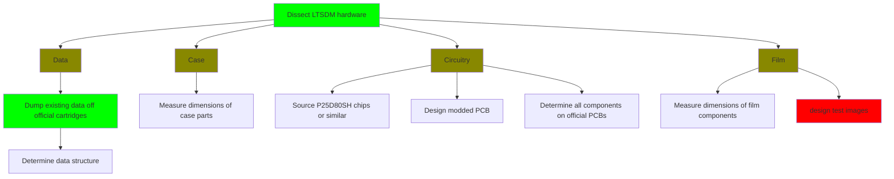

<!-- Little Tikes Story Dream Machine LTSDM custom cartridge SPI flash P25D80SH reverse engineering hex hexadecimal file format PCM audio extraction embedded Arduino a1800 codec general plus collection imhex hack .a18 .wav 16khz 16-bit signed mono -->
<h1 align="center">:construction:Under Construction:construction:</h1>

<h1 align="center">
  Custom Stories for the
   
  Little Tikes Story Dream Machine (LTSDM)
</h1>

🔜 
  
<h1 align="center">What Is This?</h1>
 <i>not my image</i>   

<body>
  The <a href="https://www.littletikes.com/collections/story-dream-machine?srsltid=AU7gw4WqiQ8R5CqPzf9FcHDLHLqfhu1rZ22Jz5EO_xHfze3l0G6kVn3B">Little Tikes Story Dream Machine (LTSDM)</a> is a toy projector geared towards young children. Each story is kept in a cartridge, or "book," that is physically inserted into the projector. Inside, the cartridge holds the following:
  
  1) audio data to be played on the projector's speakers
  2) digital instructions for the projector's rear light display
  3) twelve film slides depicting the pages of the book which the projector shines out

  Despite the appeal, the LTSDM has a few notable drawbacks:
  * Stories are highly condensed narrations spanning only about 2-3 minutes per cartridge
  * Little Tikes currently offers stories in a limited number of languages, namely: English, French, and Spanish
  * Although Little Tikes offers quite a decent collection of stories, they must be purchased in fixed bundles. This restricts the amount of freedom consumers have over story collection
  * Triple-set bundles cost roughly $24 CAD per set. This works out to about $8 per cartridge. I wonder if these could be modded for cheaper
  * Custom stories personalized to one's own children are not officially supported

  These drawbacks have led to many parents abandoning or returning the LTSDM for other audiovisual products, like [Yoto](https://ca.yotoplay.com/).

  I aim to allow any parent, caregiver, or individual to design and build their own custom cartridges compatible with the LTSDM, permitting personalized audiovisual media to be depicted by their projector.
</body>

<h1 align="center">Where Are We At?</h1>

The project consists of reverse engineering all aspects of an LTSDM cartridge to allow for fully customizable narratives. These aspects are namely: 

<h2>As of 19 September 2026, the first custom audio cartridge data was successfully ran on the LTSDM! A huge thank-you to the community of followers for assistance and encouragement over the past 16.5 months.</h2>
  
This repository documents the holistic process of hacking the Little Tikes Story Dream Machine.

  
Frontier of progress of custom cartridges:

  
  

  *see [19 September](https://github.com/mtkimmins/LTSDM_hack/wiki/19-September-2026)*
  
  
     
  
  <h2>Project Roadmap</h2>
  
  ### START
  
  ~~Crack a cartridge open~~  
  ~~Dump cartridge data~~  
  ~~Analyze dumped data~~  
  ~~Construct an encoder/decoder~~  
  ~~Package encoder/decoder~~  
  ~~Upload custom data~~  
  Make reliable audio production line  
  Print custom film reel  
  Develop 3D cartridge case model  
  Develop case cover sticker template  
  Assemble custom cartridge  
  ### FINISH
  
     
  
  ## ⚠️ DISCLAIMER ⚠️ 
  This repository is for <b>educational use only</b>. The scripts and tools provided here are intended to support legal reverse engineering and modding of content already owned by the user. Please do not use this information to distribute unauthorized copyright products.

   

  ## Directory
  
  

  
  
  

### What this Repository Contains
- **Cartridge dumping** workflows (noise reduction, repeatability, verification)
- **Container/region parsing** (documentation about segments/regions/pointers/tables)
- **Audio pipeline experiments** (codec investigations)
- **Hardware notes** for reading cartridges (breakouts/shields, wiring, voltage)

## Links to similar projects:
* [GainSec](https://github.com/GainSec/Little-Tikes-DreamProjector-Reverse-Engineering)
* [John-K](https://github.com/John-K/LittleTikesDreamProjector/)
