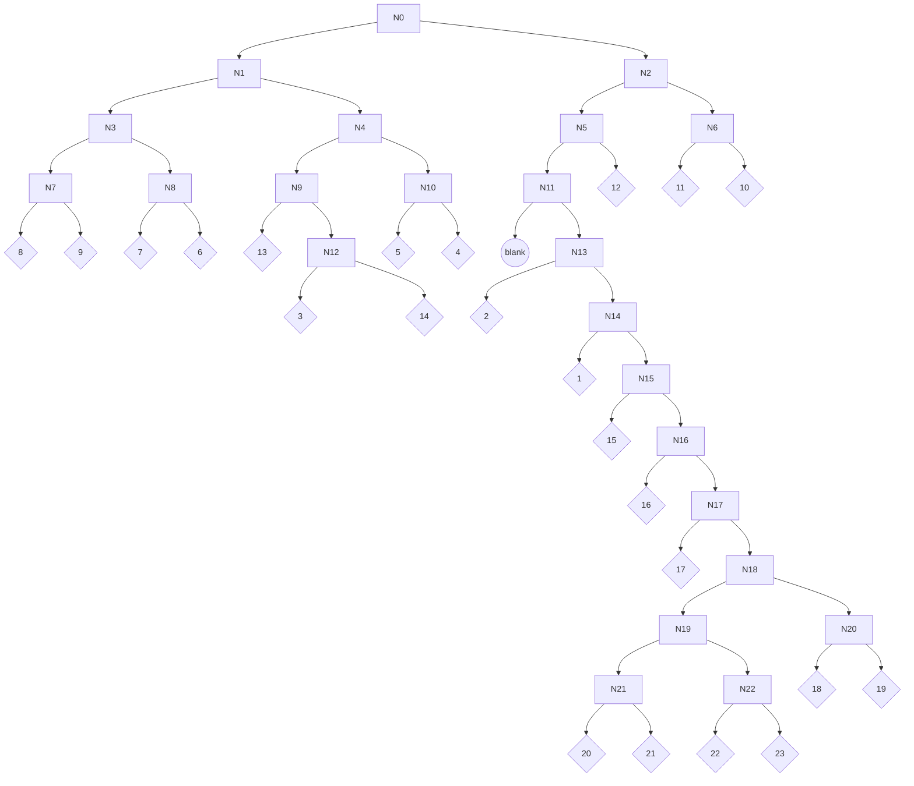

# Huffman Trees 
Data from [tables.rs](https://github.com/John-K/a1800_codec/blob/main/src/tables.rs)
|Group (#)|Lines (#)|Huffman Tree|
|:-:|:-:|:-:|
|1|49 - 71|=BLANK=|
|2|72 - 94||
|3|95 - 117||
|4|118 - 140||
|5||141 - 163||
|6||164 - 186||
|7||187 - 209||
|8||210 - 232||
|9||233 - 255||
|10|256 - 278||
|11||279 - 301||
|12|302 - 324||
|13||325 - 347||
|14||349 - 371||

## Subband 0
Blank table. This gain value is assigned from directly decoding the first 5 bits of the frame's bitstream into decimal.

## Subband 1



## Subband 2

```mermaid
graph TD
    N0-->N1
    N0-->N2
    N1-->N3
    N1-->N4
    N2-->N5
    N2-->N6
    N3-->N7
    N3-->N8
    N4-->L0{10}
    N4-->L1{9}
    N5-->L2{8}
    N5-->L3{11}
    N6-->L4{7}
    N6-->L5{6}
    N7-->N9
    N7-->L7{5}
    N8-->N10
    N8-->L8{12}
    N9-->L9{4}
    N9-->N11
    N10-->L10{13}
    N10-->L11{3}
    N11-->N12
    N11-->L12{2}
    N12-->N13
    N12-->L13{14}
    N13-->L14{1}
    N13-->N14
    N14-->N15
    N14-->L15{15}
    N15-->B1((blank))
    N15-->N16
    N16-->L16{16}
    N16-->N17
    N17-->
    N17-->
    N18-->
    N18-->
    N19-->
    N19-->
    N20-->
    N20-->
    N21-->
    N21-->
    N22-->
    N22-->
```

## Subband 3

```mermaid
graph TD
    N0-->N1
    N0-->N2
    N1-->N3
    N1-->N4
    N2-->N5
    N2-->N6
    N3-->N7
    N3-->N8
    N4-->L0{10}
    N4-->L1{9}
    N5-->L2{8}
    N5-->L3{11}
    N6-->L4{8}
    N6-->L5{11}
    N7-->L6{7}
    N7-->L7{6}
    N8-->N9
    N8-->L8{5}
    N9-->N10
    N9-->
    N10-->
    N10-->
    N11-->
    N11-->
    N12-->
    N12-->
    N13-->
    N13-->
    N14-->
    N14-->
    N15-->
    N15-->
    N16-->
    N16-->
    N17-->
    N17-->
    N18-->
    N18-->
    N19-->
    N19-->
    N20-->
    N20-->
    N21-->
    N21-->
    N22-->
    N22-->
```

## Subband 4

```mermaid
graph TD
    N0-->N1
    N0-->N2
    N1-->N3
    N1-->N4
    N2-->N5
    N2-->N6
    N3-->N7
    N3-->N8
    N4-->L0{10}
    N4-->L1{9}
    N5-->L2{8}
    N5-->L3{11}
    N6-->L4{8}
    N6-->L5{11}
    N7-->L6{7}
    N7-->L7{6}
    N8-->N9
    N8-->L8{5}
    N9-->N10
    N9-->
    N10-->
    N10-->
    N11-->
    N11-->
    N12-->
    N12-->
    N13-->
    N13-->
    N14-->
    N14-->
    N15-->
    N15-->
    N16-->
    N16-->
    N17-->
    N17-->
    N18-->
    N18-->
    N19-->
    N19-->
    N20-->
    N20-->
    N21-->
    N21-->
    N22-->
    N22-->
```

## Subband 5

```mermaid
graph TD
    N0-->N1
    N0-->N2
    N1-->N3
    N1-->N4
    N2-->N5
    N2-->N6
    N3-->N7
    N3-->N8
    N4-->L0{10}
    N4-->L1{9}
    N5-->L2{8}
    N5-->L3{11}
    N6-->L4{8}
    N6-->L5{11}
    N7-->L6{7}
    N7-->L7{6}
    N8-->N9
    N8-->L8{5}
    N9-->N10
    N9-->
    N10-->
    N10-->
    N11-->
    N11-->
    N12-->
    N12-->
    N13-->
    N13-->
    N14-->
    N14-->
    N15-->
    N15-->
    N16-->
    N16-->
    N17-->
    N17-->
    N18-->
    N18-->
    N19-->
    N19-->
    N20-->
    N20-->
    N21-->
    N21-->
    N22-->
    N22-->
```

## Subband 6

```mermaid
graph TD
    N0-->N1
    N0-->N2
    N1-->N3
    N1-->N4
    N2-->N5
    N2-->N6
    N3-->N7
    N3-->N8
    N4-->L0{10}
    N4-->L1{9}
    N5-->L2{8}
    N5-->L3{11}
    N6-->L4{8}
    N6-->L5{11}
    N7-->L6{7}
    N7-->L7{6}
    N8-->N9
    N8-->L8{5}
    N9-->N10
    N9-->
    N10-->
    N10-->
    N11-->
    N11-->
    N12-->
    N12-->
    N13-->
    N13-->
    N14-->
    N14-->
    N15-->
    N15-->
    N16-->
    N16-->
    N17-->
    N17-->
    N18-->
    N18-->
    N19-->
    N19-->
    N20-->
    N20-->
    N21-->
    N21-->
    N22-->
    N22-->
```

## Subband 7

```mermaid
graph TD
    N0-->N1
    N0-->N2
    N1-->N3
    N1-->N4
    N2-->N5
    N2-->N6
    N3-->N7
    N3-->N8
    N4-->L0{10}
    N4-->L1{9}
    N5-->L2{8}
    N5-->L3{11}
    N6-->L4{8}
    N6-->L5{11}
    N7-->L6{7}
    N7-->L7{6}
    N8-->N9
    N8-->L8{5}
    N9-->N10
    N9-->
    N10-->
    N10-->
    N11-->
    N11-->
    N12-->
    N12-->
    N13-->
    N13-->
    N14-->
    N14-->
    N15-->
    N15-->
    N16-->
    N16-->
    N17-->
    N17-->
    N18-->
    N18-->
    N19-->
    N19-->
    N20-->
    N20-->
    N21-->
    N21-->
    N22-->
    N22-->
```

## Subband 8

```mermaid
graph TD
    N0-->N1
    N0-->N2
    N1-->N3
    N1-->N4
    N2-->N5
    N2-->N6
    N3-->N7
    N3-->N8
    N4-->L0{10}
    N4-->L1{9}
    N5-->L2{8}
    N5-->L3{11}
    N6-->L4{8}
    N6-->L5{11}
    N7-->L6{7}
    N7-->L7{6}
    N8-->N9
    N8-->L8{5}
    N9-->N10
    N9-->
    N10-->
    N10-->
    N11-->
    N11-->
    N12-->
    N12-->
    N13-->
    N13-->
    N14-->
    N14-->
    N15-->
    N15-->
    N16-->
    N16-->
    N17-->
    N17-->
    N18-->
    N18-->
    N19-->
    N19-->
    N20-->
    N20-->
    N21-->
    N21-->
    N22-->
    N22-->
```

## Subband 9

```mermaid
graph TD
    N0-->N1
    N0-->N2
    N1-->N3
    N1-->N4
    N2-->N5
    N2-->N6
    N3-->N7
    N3-->N8
    N4-->L0{10}
    N4-->L1{9}
    N5-->L2{8}
    N5-->L3{11}
    N6-->L4{8}
    N6-->L5{11}
    N7-->L6{7}
    N7-->L7{6}
    N8-->N9
    N8-->L8{5}
    N9-->N10
    N9-->
    N10-->
    N10-->
    N11-->
    N11-->
    N12-->
    N12-->
    N13-->
    N13-->
    N14-->
    N14-->
    N15-->
    N15-->
    N16-->
    N16-->
    N17-->
    N17-->
    N18-->
    N18-->
    N19-->
    N19-->
    N20-->
    N20-->
    N21-->
    N21-->
    N22-->
    N22-->
```


## Subband 10
```mermaid
graph TD
    N0-->N1
    N0-->N2
    N1-->N3
    N1-->N4
    N2-->N5
    N2-->N6
    N3-->N7
    N3-->N8
    N4-->L0{10}
    N4-->L1{9}
    N5-->L2{8}
    N5-->L3{11}
    N6-->L4{8}
    N6-->L5{11}
    N7-->L6{7}
    N7-->L7{6}
    N8-->N9
    N8-->L8{5}
    N9-->N10
    N9-->
    N10-->
    N10-->
    N11-->
    N11-->
    N12-->
    N12-->
    N13-->
    N13-->
    N14-->
    N14-->
    N15-->
    N15-->
    N16-->
    N16-->
    N17-->
    N17-->
    N18-->
    N18-->
    N19-->
    N19-->
    N20-->
    N20-->
    N21-->
    N21-->
    N22-->
    N22-->
```

## Subband 11
```mermaid
graph TD
    N0-->N1
    N0-->N2
    N1-->N3
    N1-->N4
    N2-->N5
    N2-->N6
    N3-->N7
    N3-->N8
    N4-->L0{10}
    N4-->L1{9}
    N5-->L2{8}
    N5-->L3{11}
    N6-->L4{8}
    N6-->L5{11}
    N7-->L6{7}
    N7-->L7{6}
    N8-->N9
    N8-->L8{5}
    N9-->N10
    N9-->
    N10-->
    N10-->
    N11-->
    N11-->
    N12-->
    N12-->
    N13-->
    N13-->
    N14-->
    N14-->
    N15-->
    N15-->
    N16-->
    N16-->
    N17-->
    N17-->
    N18-->
    N18-->
    N19-->
    N19-->
    N20-->
    N20-->
    N21-->
    N21-->
    N22-->
    N22-->
```


## Subband 12
```mermaid
graph TD
    N0-->N1
    N0-->N2
    N1-->N3
    N1-->N4
    N2-->N5
    N2-->N6
    N3-->N7
    N3-->N8
    N4-->L0{10}
    N4-->L1{9}
    N5-->L2{8}
    N5-->L3{11}
    N6-->L4{8}
    N6-->L5{11}
    N7-->L6{7}
    N7-->L7{6}
    N8-->N9
    N8-->L8{5}
    N9-->N10
    N9-->
    N10-->
    N10-->
    N11-->
    N11-->
    N12-->
    N12-->
    N13-->
    N13-->
    N14-->
    N14-->
    N15-->
    N15-->
    N16-->
    N16-->
    N17-->
    N17-->
    N18-->
    N18-->
    N19-->
    N19-->
    N20-->
    N20-->
    N21-->
    N21-->
    N22-->
    N22-->
```


## Subband 13
```mermaid
graph TD
    N0-->N1
    N0-->N2
    N1-->N3
    N1-->N4
    N2-->N5
    N2-->N6
    N3-->N7
    N3-->N8
    N4-->L0{10}
    N4-->L1{9}
    N5-->L2{8}
    N5-->L3{11}
    N6-->L4{8}
    N6-->L5{11}
    N7-->L6{7}
    N7-->L7{6}
    N8-->N9
    N8-->L8{5}
    N9-->N10
    N9-->
    N10-->
    N10-->
    N11-->
    N11-->
    N12-->
    N12-->
    N13-->
    N13-->
    N14-->
    N14-->
    N15-->
    N15-->
    N16-->
    N16-->
    N17-->
    N17-->
    N18-->
    N18-->
    N19-->
    N19-->
    N20-->
    N20-->
    N21-->
    N21-->
    N22-->
    N22-->
```


## Subband 14
```mermaid
graph TD
    N0-->N1
    N0-->N2
    N1-->N3
    N1-->N4
    N2-->N5
    N2-->N6
    N3-->N7
    N3-->N8
    N4-->L0{10}
    N4-->L1{9}
    N5-->L2{8}
    N5-->L3{11}
    N6-->L4{8}
    N6-->L5{11}
    N7-->L6{7}
    N7-->L7{6}
    N8-->N9
    N8-->L8{5}
    N9-->N10
    N9-->
    N10-->
    N10-->
    N11-->
    N11-->
    N12-->
    N12-->
    N13-->
    N13-->
    N14-->
    N14-->
    N15-->
    N15-->
    N16-->
    N16-->
    N17-->
    N17-->
    N18-->
    N18-->
    N19-->
    N19-->
    N20-->
    N20-->
    N21-->
    N21-->
    N22-->
    N22-->
```