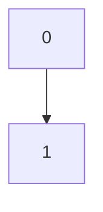

# Huffman Trees 
Data from [tables.rs](https://github.com/John-K/a1800_codec/blob/main/src/tables.rs))
|Group (#)|Lines (#)|Huffman Tree|
|:-:|:-:|:-:|
|1|49 - 71|=BLANK=|
|2|72 - 94||
|3|95 - 117||
|4|118 - 140||
|5||141 - 163||
|6||164 - 186||
|7||187 - 209||
|8||210 - 232||
|9||233 - 255||
|10|256 - 278||
|11||279 - 301||
|12|302 - 324||
|13||325 - 347||
|14||349 - 371||

## Subband 0
Blank table. This gain value is assigned from directly decoding the first 5 bits of the frame's bitstream into decimal.

## Subband 1

