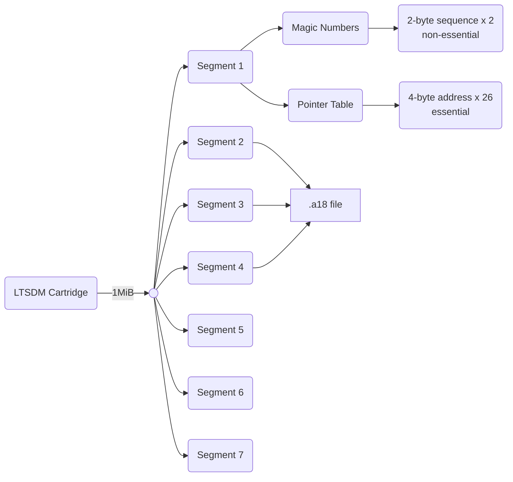

# Data Structure of an LTSDM Cartridge
## Overview
* Data stored in *Little Endian* format
* Generally speaking, an LTSDM cartridge is comprised of an initial pointer table filled with addresses of `.a18` files $\pm$ sequences of LED commands
  
**Graphical Depiction of Official LTSDM Data Structure**

